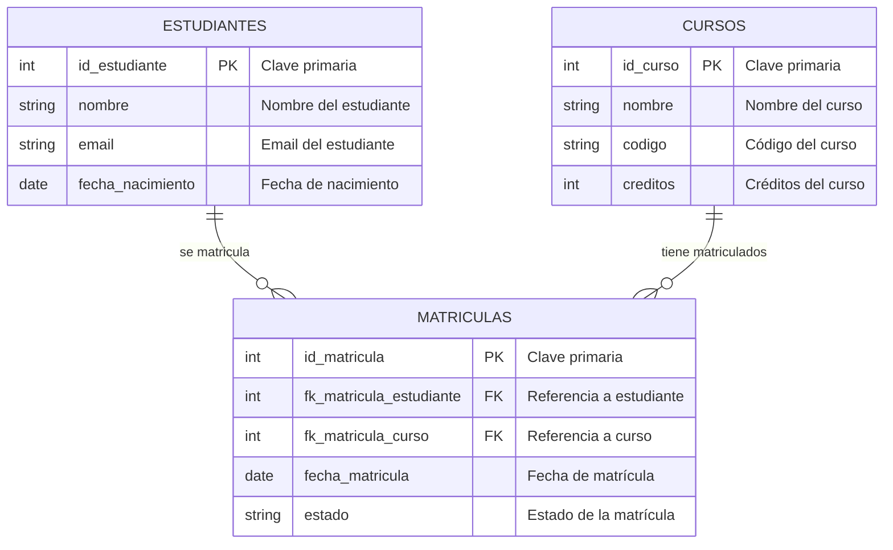

**1. Introducción teórica**

---

### 1.1. Objetivos de la sección

* Brindar a los estudiantes una comprensión fundamental de qué es una base de datos y para qué sirve.
* Diferenciar claramente entre conceptos como base de datos, tabla, registro y campo.
* Introducir brevemente MySQL como sistema gestor de bases de datos y MySQL Workbench como herramienta de interacción gráfica.

---

### 1.2. ¿Qué es una base de datos y para qué sirve?

* **Explicación conceptual sencilla**
  Una **base de datos** es un contenedor organizado de información que permite guardar, modificar y consultar datos de manera estructurada. Pensemos en una biblioteca:

  * La **base de datos** sería toda la biblioteca.
  * Cada estantería correspondería a una **tabla**.
  * Cada libro que ponemos en la estantería sería un **registro**.
  * Cada atributo del libro (título, autor, ISBN) equivale a un **campo**.

* **Analogía del mundo real**

  > “Imagina que eres el encargado de una biblioteca escolar. Necesitas registrar datos de estudiantes, libros, préstamos y devoluciones. Si guardas esa información en Excel o archivos de texto, se vuelve difícil relacionar quién pidió qué libro y cuándo. Con una base de datos, guardas las tablas (estudiantes, libros, préstamos) y puedes relacionarlas para obtener respuestas como: ‘¿Qué libros tiene prestados Juan Pérez?’ con una sola consulta.”

* **Ejercicio diagnóstico corto**

  1. Pregunta grupal: “¿Usan alguna vez Google Sheets o Excel? ¿Cuál es la diferencia entre tener datos en filas y columnas y tenerlos en forma de tablas interrelacionadas?”
  2. Objetivo: que el estudiante identifique la ventaja de relacionar tablas frente a guardar todo en un mismo archivo.

---

### 1.3. Conceptos básicos: base de datos, tabla, registro y campo

* **Base de datos (Database):**
  Repositorio lógico que agrupa varias **tablas**. Cada base de datos en MySQL es un espacio independiente de nombres para tablas, vistas, procedimientos, etc.

* **Tabla (Table):**
  Conjunto de datos organizados en filas y columnas. Cada tabla modela una entidad de la vida real (por ejemplo, “Estudiantes”).

* **Registro (Row o Record):**
  Cada fila de la tabla es un registro: la instancia particular de la entidad. Ejemplo:

  | id\_estudiante                                                                       | nombre         | fecha\_nacimiento |
  | ------------------------------------------------------------------------------------ | -------------- | ----------------- |
  | 1                                                                                    | María González | 2005-04-12        |
  | El registro con id\_estudiante=1 es “María González, nacida el 12 de abril de 2005”. |                |                   |

* **Campo (Column o Field):**
  Cada columna de la tabla describe un atributo de la entidad. En la tabla anterior, “nombre” y “fecha\_nacimiento” son campos.

* **Ejemplo visual (diagrama conceptual):**

  ```mermaid
  erDiagram
      LIBROS {
          int id_libro PK "Clave primaria"
          string titulo "Título del libro"
          string autor "Autor del libro"
      }
      
      ESTUDIANTES {
          int id_estudiante PK "Clave primaria"
          string nombre "Nombre del estudiante"
          date fecha_nacimiento "Fecha de nacimiento"
      }
      
      PRESTAMOS {
          int id_prestamo PK "Clave primaria"
          int id_libro FK "Referencia a libro"
          int id_estudiante FK "Referencia a estudiante"
          date fecha_prestamo "Fecha del préstamo"
          date fecha_devolucion "Fecha de devolución"
      }
      
      LIBROS ||--o{ PRESTAMOS : "puede ser prestado en"
      ESTUDIANTES ||--o{ PRESTAMOS : "puede solicitar"
  ```

* **Actividad breve (5 minutos):**
  En parejas, describan en papel dos entidades de una tienda en línea (ej.: “Clientes” y “Productos”) y definan al menos tres campos para cada una. Luego compartir en plenaria.

---

### 1.4. Introducción a MySQL y MySQL Workbench

* **¿Qué es MySQL?**

  * MySQL es un **sistema gestor de bases de datos relacional** (RDBMS) de código abierto.
  * Funciona mediante un **servidor** (MySQL Server) que aloja bases de datos y procesa peticiones SQL para crear/leer/actualizar/eliminar datos (CRUD).
  * Impulsa aplicaciones web, sistemas de e-commerce, y es muy común en entornos académicos y profesionales.

* **¿Qué es MySQL Workbench?**

  * Es una **herramienta gráfica oficial** para interactuar con MySQL.
  * Permite diseñar diagramas ER (Entidad-Relación), ejecutar consultas SQL, modelar bases de datos, gestionar usuarios y ver el esquema de tablas de manera visual.
  * Es multiplataforma (Windows, macOS, Linux).

* **Capturas de pantalla sugeridas**

  1. Ventana principal de MySQL Workbench al abrirlo.
  2. Ejemplo de “New Connection” donde se configuran host, puerto, usuario, contraseña.
  3. Ventana de SQL Editor con pestañas de “Query 1”, área de resultados y árbol de objetos a la izquierda.

  * *Descripción visual*:

    * Panel izquierdo: “Catalog Tree” con base de datos → tablas → vistas.
    * Panel central: espacio para escribir consultas SQL.
    * Panel inferior: resultado de la consulta y mensajes de error.

* **Ejercicio de diagnóstico (5 minutos):**

  1. Abrir MySQL Workbench.
  2. Identifiquen:

     * Panel de “Navigator” (catálogo).
     * Botón “+” para abrir un nuevo query.
     * Menú “File” y “Server” para gestionar conexiones y configuraciones.

---

**2. Configuración del entorno (30 minutos)**

---

### 2.1. Requisitos previos y descarga de MySQL y MySQL Workbench

* **Requisitos de sistema básicos**

  * Windows 10 o 11 (mínimo Windows 7 SP1), macOS Catalina o superior, Linux Ubuntu 18.04 o similar.
  * 2 GB de RAM mínimo (4 GB recomendado).
  * Espacio en disco: \~500 MB para MySQL Server + \~200 MB para Workbench.

* **Descargar MySQL Server 8.0**

  1. Ingresar a [https://dev.mysql.com/downloads/mysql/](https://dev.mysql.com/downloads/mysql/)
  2. Seleccionar la versión “MySQL Community Server 8.0.x” para tu sistema operativo.
  3. Elegir “Windows (x86, 64-bit), MSI Installer” o “macOS 10.15 (x86, 64-bit), DMG” según corresponda.
  4. Descargar e instalar paso a paso (Next → Accept License → Full o Custom según prefieras).

     * **Durante la instalación**:

       * Elegir tipo de configuración “Developer Default” (instala MySQL Server, componentes, MySQL Shell, MySQL Workbench).
       * Crear contraseña para el usuario `root`.
       * Configurar el puerto 3306 (puerto por defecto).
       * Elegir servicio Windows como “MySQL80” (o equivalentes en Linux/macOS).
  5. Verificar servicio:

     * Windows: Ir a “Services” y confirmar que “MySQL80” está en estado “Running”.
     * macOS/Linux: En terminal, ejecutar `sudo systemctl status mysql` o `brew services list` (si se instaló con Homebrew).

* **Descargar MySQL Workbench 8.0**

  1. Ingresar a [https://dev.mysql.com/downloads/workbench/](https://dev.mysql.com/downloads/workbench/)
  2. Seleccionar el instalador para tu OS.
  3. Instalar con permisos de administrador.
  4. Una vez finalizada la instalación, abrir MySQL Workbench.

* **Capturas de pantalla sugeridas**
  1. Pantalla de configuración de contraseña de `root` en MySQL Installer.
  2. Vista de MySQL Installer mostrando “Products Selected” con MySQL Server y Workbench.
  3. Ventana inicial de MySQL Workbench antes de crear la conexión.

---

### 2.2. Configuración de la conexión en MySQL Workbench

* **Paso a paso para establecer una conexión local**

  1. Abrir MySQL Workbench.
  2. En “MySQL Connections”, hacer clic en el botón “+” (Create New Connection).
  3. En **Connection Name**, escribir: `Localhost_TallerBD`.
  4. En **Connection Method**, seleccionar “Standard (TCP/IP)”.
  5. **Hostname:** `127.0.0.1` (o `localhost`).
  6. **Port:** `3306`.
  7. **Username:** `root`.
  8. **Password:** hacer clic en “Store in Vault…” e ingresar la contraseña que definimos durante la instalación.
  9. Hacer clic en “Test Connection”:

     * Si aparece “Successfully made the MySQL connection”, todo es correcto.
     * Si aparece un error, revisar que el servicio MySQL esté corriendo, que la contraseña sea correcta y que el puerto 3306 no esté ocupado.
  10. Hacer clic en “OK” para guardar la conexión.

* **Descripción de los principales elementos**

  * **Scheme / Catalog Tree** (panel izquierdo): muestra las bases de datos existentes bajo la conexión activa.
  * **SQL Editor** (panel central): espacio donde se escriben y ejecutan las consultas.
  * **Query Tab**: cada pestaña permite tener un script SQL independiente.
  * **Resultado y Mensajes** (panel inferior): muestra las filas retornadas, estado de ejecución y posibles errores.

* **Ejercicios guiados (15 minutos):**

  1. Cree la conexión `Local_Taller` siguiendo los pasos anteriores.
  2. Probamos dos comandos en el SQL Editor:

     ```sql
     -- Verificar la versión de MySQL
     SELECT VERSION();
     -- Crear una base de datos de prueba
     CREATE DATABASE TallerBD;
     -- Verificar que la base de datos se creó
     SHOW DATABASES;
     ```
  3. Discusión en plenaria: ¿Qué vimos?

     * El resultado de `SELECT VERSION();` muestra “8.0.x”.
     * `CREATE DATABASE TallerBD;` crea la base de datos.
     * `SHOW DATABASES;` lista “information\_schema”, “mysql”, “performance\_schema”, “sys” y “TallerBD”.

* **Errores comunes y soluciones en esta sección**

  1. **Error “Access denied for user 'root'@'localhost'”**

     * Causa: Contraseña incorrecta o usuario `root` no configurado correctamente.
     * Solución: Reinstalar MySQL o resetear la contraseña de `root` desde la línea de comandos:

       ```bash
       # En Linux/Mac:
       sudo mysqld_safe --skip-grant-tables &
       mysql -u root
       ALTER USER 'root'@'localhost' IDENTIFIED BY 'NuevaContraseña';
       FLUSH PRIVILEGES;
       ```
  2. **Error “Can’t connect to MySQL server on 'localhost' (10061)”**

     * Causa: El servicio de MySQL no está en ejecución.
     * Solución: Iniciar el servicio:

       * Windows: Services → iniciar “MySQL80”.
       * Linux/macOS: `sudo systemctl start mysql` o `brew services start mysql`.
  3. **Error “Unknown database ‘TallerBD’” al usarla antes de crearla**

     * Causa: Intentar `USE TallerBD;` antes de `CREATE DATABASE TallerBD;`.
     * Solución: Crear primero la base de datos o usar `CREATE DATABASE IF NOT EXISTS TallerBD;`.

---

**3. Ejercicios prácticos graduales (90 minutos)**

> **Nota pedagógica:** Esta sección se divide en dos bloques generales:
>
> 1. **Operaciones básicas (45 minutos)**
> 2. **Operaciones intermedias (45 minutos)**

Durante cada bloque, se presentará:

* Breve explicación conceptual (3–5 minutos por tema).
* Ejemplo de código SQL comentado.
* Descripción de la salida esperada (”Result Set”).
* Ejercicio práctico con indicaciones paso a paso.
* Solución comentada y puntos de verificación.
* Errores comunes para diagnosticar.

---

#### 3.1. Bloque 1: Operaciones básicas (45 minutos)

---

##### 3.1.1. Crear base de datos y cambiar de contexto

* **Concepto:**
  Antes de crear tablas, debemos definir la base de datos en la cual trabajaremos.

* **SQL comentado:**

  ```sql
  -- Creamos la base de datos llamada 'TallerBD'
  CREATE DATABASE IF NOT EXISTS TallerBD 
    CHARACTER SET utf8mb4 
    COLLATE utf8mb4_spanish_ci;

  -- Cambiamos el contexto a la base de datos 'TallerBD'
  USE TallerBD;
  ```

  > • `IF NOT EXISTS` evita error si ya existe.
  > • `CHARACTER SET utf8mb4` y `COLLATE utf8mb4_spanish_ci` configuran codificación en español con acentos.

* **Salida esperada:**

  * Tras `CREATE DATABASE...`: mensaje “Query OK, 1 row affected” (si es nueva).
  * Tras `USE TallerBD;`: mensaje “Database changed”.

* **Ejercicio práctico (5 minutos):**

  1. Ejecute las dos sentencias anteriores.
  2. Verificar con `SHOW DATABASES;` que “TallerBD” aparece.
  3. Verificar con `SELECT DATABASE();` que el contexto es “TallerBD”.

* **Errores comunes:**

  1. **“ERROR 1007 (HY000): Can't create database 'TallerBD'; database exists”**

     * Causa: La BD ya existe y no se incluyó `IF NOT EXISTS`.
     * Solución: Agregar `IF NOT EXISTS` o eliminar la base de datos con `DROP DATABASE TallerBD;` (con cuidado).
  2. **“ERROR 1049 (42000): Unknown database 'TallerBD'” en `USE TallerBD;`**

     * Causa: No ejecutar primero `CREATE DATABASE`.
     * Solución: Ejecutar `CREATE DATABASE` o ver que la base de datos exista con `SHOW DATABASES;`.

---

##### 3.1.2. Crear tablas con diferentes tipos de datos

* **Concepto:**
  Una tabla se define especificando columnas (campos) con tipo de dato. MySQL 8.0 soporta tipos como `INT`, `VARCHAR`, `DATE`, `DECIMAL`, etc.

* **Modelo de ejemplo (sistema escolar):**

  * `Estudiantes`: almacena datos de alumnos.
  * `Cursos`: almacena asignaturas.
  * `Profesores`: almacena datos de docentes.
  * `Matriculas`: tabla intermedia que relaciona `Estudiantes` y `Cursos`.

* **Diagrama conceptual (diagrama ER simplificado):**

  ```mermaid
  erDiagram
      PROFESORES {
          int id_profesor PK "Clave primaria"
          string nombre "Nombre del profesor"
          string especialidad "Especialidad del profesor"
      }
      
      CURSOS {
          int id_curso PK "Clave primaria"
          string nombre "Nombre del curso"
          int creditos "Créditos del curso"
          int id_profesor FK "Profesor asignado"
      }
      
      ESTUDIANTES {
          int id_estudiante PK "Clave primaria"
          string nombre "Nombre del estudiante"
          date fecha_nac "Fecha de nacimiento"
      }
      
      MATRICULAS {
          int id_matricula PK "Clave primaria"
          int id_estudiante FK "Referencia a estudiante"
          int id_curso FK "Referencia a curso"
          date fecha_matricula "Fecha de matrícula"
      }
      
      PROFESORES ||--o{ CURSOS : "enseña"
      ESTUDIANTES ||--o{ MATRICULAS : "se matricula en"
      CURSOS ||--o{ MATRICULAS : "tiene matriculados"
  ```

* **Creación de tabla `Estudiantes`:**

  ```sql
  -- Tabla Estudiantes
  CREATE TABLE IF NOT EXISTS Estudiantes (
    id_estudiante INT AUTO_INCREMENT PRIMARY KEY,  -- PK autoincremental
    nombre VARCHAR(100) NOT NULL,                  -- Nombre completo del estudiante
    fecha_nacimiento DATE NOT NULL,                -- Fecha de nacimiento
    correo VARCHAR(150) UNIQUE,                    -- Correo electrónico (único)
    telefono VARCHAR(15),                          -- Teléfono (opcional)
    fecha_creacion TIMESTAMP DEFAULT CURRENT_TIMESTAMP
    -- Fecha en que se creó el registro
  ) ENGINE=InnoDB;
  ```

  > • `AUTO_INCREMENT` y `PRIMARY KEY` definen la clave primaria.
  > • `VARCHAR(100)` almacena cadenas de hasta 100 caracteres.
  > • `DATE` para fechas (YYYY-MM-DD).
  > • `UNIQUE` en `correo` asegura que no haya dos estudiantes con el mismo email.
  > • `ENGINE=InnoDB` habilita claves foráneas y transacciones.

* **Creación de tabla `Cursos`:**

  ```sql
  -- Tabla Cursos
  CREATE TABLE IF NOT EXISTS Cursos (
    id_curso INT AUTO_INCREMENT PRIMARY KEY,
    nombre VARCHAR(100) NOT NULL,
    creditos INT NOT NULL CHECK (creditos > 0 AND creditos <= 10),
    descripcion TEXT,  -- Descripción opcional
    fecha_creacion TIMESTAMP DEFAULT CURRENT_TIMESTAMP
  ) ENGINE=InnoDB;
  ```

* **Creación de tabla `Profesores`:**

  ```sql
  -- Tabla Profesores
  CREATE TABLE IF NOT EXISTS Profesores (
    id_profesor INT AUTO_INCREMENT PRIMARY KEY,
    nombre VARCHAR(100) NOT NULL,
    especialidad VARCHAR(100),
    correo VARCHAR(150) UNIQUE,
    telefono VARCHAR(15),
    fecha_contratacion DATE
  ) ENGINE=InnoDB;
  ```

* **Ejercicio práctico (5 minutos):**

  1. Creen las tres tablas (`Estudiantes`, `Cursos`, `Profesores`) en su base de datos `TallerBD`.
  2. Verificar con `SHOW TABLES;` que las tablas aparecen.

* **Errores comunes:**

  1. **“ERROR 1064 (42000): You have an error in your SQL syntax”**

     * Causa: Problema de sintaxis, por ejemplo, falta de coma o paréntesis.
     * Solución: Revisar comas al final de cada campo, paréntesis de apertura y cierre antes de `ENGINE=InnoDB;`.
  2. **“ERROR 1503 (HY000): Incorrect table definition; there can be only one TIMESTAMP column with CURRENT\_TIMESTAMP as default”**

     * Causa: Intento de definir más de una columna `TIMESTAMP` con `DEFAULT CURRENT_TIMESTAMP`.
     * Solución: Usar solo una columna con `DEFAULT CURRENT_TIMESTAMP`, o cambiar otra columna a tipo `DATETIME`.

---

##### 3.1.3. Inserción de registros (INSERT)

* **Concepto:**
  Para guardar datos en una tabla se utiliza la sentencia `INSERT`.

* **Ejemplo de inserciones comentadas:**

  ```sql
  -- Insertar registros en Estudiantes
  INSERT INTO Estudiantes (nombre, fecha_nacimiento, correo, telefono)
  VALUES
    ('María González', '2005-04-12', 'maria.gonzalez@example.com', '3001234567'),
    ('Juan Pérez',    '2004-09-30', 'juan.perez@example.com',    NULL),
    ('Luisa Martínez','2006-01-25', 'luisa.martinez@example.com','3109876543');

  -- Insertar registros en Cursos
  INSERT INTO Cursos (nombre, creditos, descripcion)
  VALUES
    ('Matemáticas I', 4, 'Fundamentos de Álgebra y Aritmética'),
    ('Física I',      3, 'Conceptos básicos de Mecánica'),
    ('Programación',  5, 'Introducción a la programación con Python');

  -- Insertar registros en Profesores
  INSERT INTO Profesores (nombre, especialidad, correo, telefono, fecha_contratacion)
  VALUES
    ('Ana Ramírez', 'Matemáticas', 'ana.ramirez@escuela.edu', '3217654321', '2020-02-15'),
    ('Carlos Díaz', 'Física',      'carlos.diaz@escuela.edu',  '3224567890', '2019-08-01'),
    ('Marina López','Informática', 'marina.lopez@escuela.edu', NULL,         '2021-06-10');
  ```

  > • En `INSERT INTO Tabla (col1, col2, ...) VALUES (...);`
  > • Si no se especifica una columna con `AUTO_INCREMENT`, MySQL la asignará automáticamente.
  > • En los valores, `NULL` indica dato ausente.

* **Salida esperada:**

  * Mensajes “Query OK, 3 rows affected” (para cada INSERT múltiple) o número de filas que corresponda.

* **Ejercicio práctico (5 minutos):**

  1. Que cada estudiante ejecute los scripts anteriores.
  2. Verificar con `SELECT * FROM Estudiantes;` que aparezcan los 3 registros con sus columnas.
  3. Después, `SELECT * FROM Cursos;` y `SELECT * FROM Profesores;` para validar.

* **Errores comunes:**

  1. **“ERROR 1048 (23000): Column 'correo' cannot be null”**

     * Causa: Intentar insertar `NULL` en una columna `NOT NULL`.
     * Solución: Omitir la columna en la lista de campos si es opcional, o proporcionar un valor válido.
  2. **“ERROR 1062 (23000): Duplicate entry '[juan.perez@example.com](mailto:juan.perez@example.com)' for key 'correo'”**

     * Causa: El campo `correo` está definido como `UNIQUE` y se está intentando duplicar.
     * Solución: Usar un correo diferente o eliminar el `UNIQUE` si no se desea restricción.

---

##### 3.1.4. Consultas básicas (SELECT) y filtrado (WHERE)

* **Concepto de SELECT:**
  `SELECT columnas FROM tabla;` recupera datos. Se puede filtrar con `WHERE`.

* **Ejemplos comentados:**

  ```sql
  -- 1. Seleccionar todos los campos de Estudiantes
  SELECT * 
  FROM Estudiantes;

  -- 2. Seleccionar solo nombre y fecha de nacimiento
  SELECT nombre, fecha_nacimiento 
  FROM Estudiantes;

  -- 3. Filtrar estudiantes nacidos después del 1 de enero de 2005
  SELECT nombre, fecha_nacimiento 
  FROM Estudiantes
  WHERE fecha_nacimiento > '2005-01-01';

  -- 4. Filtrar por email específico
  SELECT * 
  FROM Estudiantes
  WHERE correo = 'juan.perez@example.com';
  ```

  > • `*` indica “todas las columnas”.
  > • `WHERE` usa condiciones lógicas.
  > • Fechas deben ir entre comillas simples en formato `'YYYY-MM-DD'`.

* **Salida esperada:**

  * Para `SELECT * FROM Estudiantes;`, muestra 3 filas.
  * Para el filtrado de fecha, solo “María González” y “Luisa Martínez” (nacidas en 2005 y 2006).

* **Ejercicio práctico (5 minutos):**

  1. Identifiquen cuántos estudiantes tienen teléfono registrado (no `NULL`):

     ```sql
     SELECT nombre 
     FROM Estudiantes
     WHERE telefono IS NOT NULL;
     ```
  2. Mostrar todos los cursos cuyo número de créditos sea mayor o igual a 4:

     ```sql
     SELECT nombre, creditos
     FROM Cursos
     WHERE creditos >= 4;
     ```

* **Errores comunes:**

  1. **“ERROR 1054 (42S22): Unknown column 'nombree' in 'field list'”**

     * Causa: Escribir mal el nombre de la columna.
     * Solución: Verificar con `DESCRIBE Estudiantes;` la lista exacta de columnas.
  2. **No usar comillas al comparar cadenas**

     * Ejemplo de error: `WHERE nombre = María González` en lugar de `WHERE nombre = 'María González'`.
     * Solución: Siempre encerrar cadenas en comillas simples.

---

##### 3.1.5. Ordenamiento (ORDER BY) y funciones de agregación simples

* **Concepto de ORDER BY:**
  Ordena el resultado ascendente (`ASC`, por defecto) o descendente (`DESC`).

* **Funciones de agregación:**

  * `COUNT(columna)` cuenta registros no nulos.
  * `SUM(columna)` suma valores numéricos.
  * `AVG(columna)` promedio.
  * `MAX(columna)`, `MIN(columna)` valores máximo y mínimo.
  * Uso de `GROUP BY` para agrupar resultados.

* **Ejemplo comentado:**

  ```sql
  -- 1. Listar estudiantes ordenados por fecha de nacimiento descendente (del más joven al más viejo)
  SELECT nombre, fecha_nacimiento
  FROM Estudiantes
  ORDER BY fecha_nacimiento DESC;

  -- 2. Contar cuántos estudiantes tengo
  SELECT COUNT(*) AS total_estudiantes
  FROM Estudiantes;

  -- 3. Contar cuántos cursos hay con créditos >= 4
  SELECT COUNT(*) AS cursos_mayor_4_creditos
  FROM Cursos
  WHERE creditos >= 4;

  -- 4. Mostrar el promedio de créditos entre todos los cursos
  SELECT AVG(creditos) AS promedio_creditos
  FROM Cursos;

  -- 5. Mostrar el número de cursos por cada número de créditos (uso de GROUP BY)
  SELECT creditos, COUNT(*) AS cant_cursos
  FROM Cursos
  GROUP BY creditos;
  ```

  > • `AS` renombra la columna en el resultado.
  > • `GROUP BY` agrupa por nivel de créditos y cuenta cuántos cursos hay en cada grupo.

* **Salida esperada:**

  * Para `ORDER BY`, los nombres ordenados según fecha.
  * Para `COUNT(*)`, un solo número: 3 estudiantes.
  * Para `AVG(creditos)`, promedio (en este caso: (4 + 3 + 5) / 3 = 4).
  * Para `GROUP BY`, filas como:

    | creditos | cant\_cursos |
    | -------- | ------------ |
    | 3        | 1            |
    | 4        | 1            |
    | 5        | 1            |

* **Ejercicio práctico (5 minutos):**

  1. Mostrar la lista de profesores ordenados alfabéticamente por nombre:

     ```sql
     SELECT nombre 
     FROM Profesores
     ORDER BY nombre ASC;
     ```
  2. ¿Cuántos profesores fueron contratados después del 1 de enero de 2020?

     ```sql
     SELECT COUNT(*) AS prof_contratados_desde_2020
     FROM Profesores
     WHERE fecha_contratacion > '2020-01-01';
     ```
  3. Mostrar la cantidad de profesores por especialidad:

     ```sql
     SELECT especialidad, COUNT(*) AS cantidad
     FROM Profesores
     GROUP BY especialidad;
     ```

* **Errores comunes:**

  1. **“ERROR 1055 (42000): ‘TallerBD.Especialidad’ isn’t in GROUP BY”**

     * Causa: En configuraciones estricas (`ONLY_FULL_GROUP_BY`), todas las columnas en `SELECT` que no están agregadas deben estar en el `GROUP BY`.
     * Solución: Agregar `especialidad` al `GROUP BY` (como en el ejemplo), o bien cambiar la configuración SQL\_MODE si el curso lo permite (no recomendado a nivel inicial).
  2. **Olvidar `ASC` o `DESC`**

     * Por defecto, MySQL usa `ASC`. Si queremos descendente, siempre especificar `DESC`.

---

##### 3.1.6. Filtrado avanzado con funciones de agregación y GROUP BY

* **Concepto:**
  Combinar `GROUP BY` con cláusulas `HAVING` para filtrar después de agrupar.

* **Ejemplo comentado:**

  ```sql
  -- 1. Mostrar número de estudiantes nacidos en cada año y filtrar solo años con más de 1 estudiante
  SELECT YEAR(fecha_nacimiento) AS anio_nac, COUNT(*) AS cantidad
  FROM Estudiantes
  GROUP BY YEAR(fecha_nacimiento)
  HAVING COUNT(*) > 1;

  -- 2. Mostrar, para cada especialidad de profesor, cuántos hay y solo incluir especialidades con 2 o más profesores
  SELECT especialidad, COUNT(*) AS cant_profesores
  FROM Profesores
  GROUP BY especialidad
  HAVING COUNT(*) >= 2;
  ```

  > • `YEAR(fecha_nacimiento)` extrae el año de la fecha.
  > • `HAVING` filtra grupos resultantes de `GROUP BY` (no se puede usar `WHERE` para condiciones sobre agregados).

* **Salida esperada:**
  Dependiendo de los datos:

  * Por ejemplo, si solo hay un estudiante por año, no devuelve filas.
  * Si agregamos otro estudiante del mismo año, sí.

* **Ejercicio práctico (5 minutos):**

  1. Insertar un estudiante adicional para forzar un grupo con más de uno:

     ```sql
     INSERT INTO Estudiantes (nombre, fecha_nacimiento, correo)
     VALUES ('Pedro Fernández','2005-11-20','pedro.fernandez@example.com');
     ```
  2. Ejecutar la consulta del año de nacimiento con `HAVING`.
  3. ¿Qué años aparecen ahora? (Debería aparecer 2005 con cantidad 2).

* **Errores comunes:**

  1. **Usar `WHERE` en lugar de `HAVING` para filtrar agregados:**

     * Ejemplo erróneo:

       ```sql
       SELECT YEAR(fecha_nacimiento) AS anio_nac, COUNT(*) AS cantidad
       FROM Estudiantes
       WHERE COUNT(*) > 1  -- ❌ ERROR: no se puede usar COUNT() en WHERE
       GROUP BY YEAR(fecha_nacimiento);
       ```
     * Solución: Mover la condición a `HAVING`.
  2. **No agrupar por la misma expresión que se selecciona:**

     * Si se selecciona `YEAR(fecha_nacimiento)`, debe aparecer exactamente en `GROUP BY`.

---

#### 3.2. Bloque 2: Operaciones intermedias (45 minutos)

---

##### 3.2.1. Relaciones entre tablas: PRIMARY KEY y FOREIGN KEY

* **Concepto:**

  * **PRIMARY KEY** (clave primaria) identifica unívocamente cada registro en la tabla.
  * **FOREIGN KEY** (clave foránea) es un campo en una tabla que apunta a la clave primaria de otra tabla, estableciendo una relación.
  * Las claves foráneas permiten mantener la integridad referencial: no se puede insertar un valor foráneo que no exista en la tabla padre.

* **Ejemplo: tabla `Matriculas` con claves foráneas:**

  ```sql
  -- Crear tabla Matriculas
  CREATE TABLE IF NOT EXISTS Matriculas (
    id_matricula INT AUTO_INCREMENT PRIMARY KEY,
    id_estudiante INT NOT NULL,
    id_curso INT NOT NULL,
    fecha_matricula DATE NOT NULL DEFAULT CURRENT_DATE,
    nota_final DECIMAL(4,2),  -- ejemplo: 8.75
    -- Definición de claves foráneas
    CONSTRAINT fk_matricula_estudiante
      FOREIGN KEY (id_estudiante) REFERENCES Estudiantes(id_estudiante)
      ON DELETE CASCADE 
      ON UPDATE CASCADE,
    CONSTRAINT fk_matricula_curso
      FOREIGN KEY (id_curso) REFERENCES Cursos(id_curso)
      ON DELETE RESTRICT
      ON UPDATE CASCADE
  ) ENGINE=InnoDB;
  ```

  > • `ON DELETE CASCADE`: si se elimina un estudiante, se borran en cascada sus matrículas.
  > • `ON DELETE RESTRICT`: no se puede eliminar un curso si hay matriculas relacionadas.
  > • `ON UPDATE CASCADE`: si cambia el `id` del padre, se actualiza en la tabla hija (poco común para `INT AUTO_INCREMENT`, pero ilustrativo).

* **Diagrama de relaciones actualizado (simplificado):**



* **Ejercicio práctico (5 minutos):**

  1. Crear la tabla `Matriculas` copiando el script anterior.
  2. Verificar con `SHOW CREATE TABLE Matriculas;` que las claves foráneas aparezcan definidas.
  3. Probar la restricción: intentar eliminar un `Curso` con `id_curso = 1` (si existe alguna matrícula con ese curso):

     ```sql
     DELETE FROM Cursos WHERE id_curso = 1;
     ```

     * Debería devolver un error de restricción referencial (`Cannot delete or update a parent row: a foreign key constraint fails`).

* **Errores comunes:**

  1. **“ERROR 1005 (HY000): Can't create table 'TallerBD.Matriculas' (errno: 150 “Foreign key constraint is incorrectly formed”)”**

     * Causa: La tabla padre no existe, o el tipo de dato / colación no coincide.
     * Solución: Verificar que `Estudiantes` y `Cursos` existan y que las columnas referenciadas (`id_estudiante`, `id_curso`) sean del mismo tipo (`INT`) y ambos InnoDB.
  2. **“ERROR 1215 (HY000): Cannot add foreign key constraint”**

     * Causa: Múltiples motivos: tipos de dato diferentes, motor de almacenamiento distinto, colación distinta.
     * Solución: Asegurarse de que ambas tablas sean InnoDB, columnas referenciadas tengan el mismo tipo y longitud.

---

##### 3.2.2. INNER JOIN (Combinar datos de múltiples tablas)

* **Concepto:**
  `INNER JOIN` devuelve solo las filas donde la condición de unión sea verdadera en ambas tablas.

* **Ejemplo comentado:**

  ```sql
  -- 1. Mostrar todas las matrículas con el nombre del estudiante y nombre del curso
  SELECT 
    m.id_matricula,
    e.nombre AS nombre_estudiante,
    c.nombre AS nombre_curso,
    m.fecha_matricula,
    m.nota_final
  FROM Matriculas m
  INNER JOIN Estudiantes e 
    ON m.id_estudiante = e.id_estudiante
  INNER JOIN Cursos c
    ON m.id_curso = c.id_curso;
  ```

  > • `m`, `e`, `c` son alias para las tablas `Matriculas`, `Estudiantes` y `Cursos`.
  > • `e.nombre AS nombre_estudiante`: renombra la columna en el resultado.
  > • Solo se mostrarán matriculas que tengan estudiante y curso válido (INNER JOIN).

* **Salida esperada:**

  | id\_matricula | nombre\_estudiante | nombre\_curso | fecha\_matricula | nota\_final |
  | ------------- | ------------------ | ------------- | ---------------- | ----------- |
  | 1             | María González     | Matemáticas I | 2024-03-05       | 8.75        |
  | 2             | Juan Pérez         | Física I      | 2024-03-10       | 9.00        |
  | …             | …                  | …             | …                | …           |

* **Ejercicio práctico (7 minutos):**

  1. Insertar algunas filas adicionales en `Matriculas`:

     ```sql
     INSERT INTO Matriculas (id_estudiante, id_curso, fecha_matricula, nota_final)
     VALUES
       (1, 1, '2024-03-05', 8.75),
       (2, 2, '2024-03-10', 9.00),
       (3, 3, '2024-04-01', NULL);  -- Nota pendiente
     ```
  2. Ejecutar la consulta `INNER JOIN` previamente mostrada.
  3. Verificar que aparezcan solo las filas donde existen correspondencias en las tres tablas.

* **Errores comunes:**

  1. **Usar `=` en la cláusula `JOIN` con columnas que no existen o mal tipeadas:**

     * Ejemplo erróneo: `ON m.id_estudiantex = e.id_estudiante` → columna `id_estudiantex` no existe.
     * Solución: Verificar nombres de columnas con `SHOW COLUMNS FROM Matriculas;`.
  2. **Olvidar el alias al referenciar una columna ambigua:**

     * Si ambas tablas tienen columna `nombre`, al pedir `SELECT nombre` se producirá error “Column 'nombre' in field list is ambiguous.”
     * Solución: usar alias: `e.nombre` o `c.nombre`.

---

##### 3.2.3. LEFT JOIN y RIGHT JOIN (Incluir registros no coincidentes)

* **Concepto:**

  * **LEFT JOIN**: devuelve todas las filas de la tabla izquierda (A), y las filas coincidentes de la tabla derecha (B). Si no hay coincidencia, aparecen valores `NULL` para las columnas de B.
  * **RIGHT JOIN**: análogo, pero devuelve todas las filas de la tabla derecha y las coincidencias de la izquierda.

* **Ejemplos comentados:**

  ```sql
  -- 1. LEFT JOIN: Mostrar todos los estudiantes aunque no tengan matrícula
  SELECT 
    e.id_estudiante,
    e.nombre AS nombre_estudiante,
    c.nombre AS nombre_curso,
    m.fecha_matricula
  FROM Estudiantes e
  LEFT JOIN Matriculas m
    ON e.id_estudiante = m.id_estudiante
  LEFT JOIN Cursos c
    ON m.id_curso = c.id_curso;

  -- 2. RIGHT JOIN: Mostrar todos los cursos aunque no tengan estudiantes matriculados
  SELECT 
    c.id_curso,
    c.nombre AS nombre_curso,
    e.nombre AS nombre_estudiante,
    m.fecha_matricula
  FROM Estudiantes e
  RIGHT JOIN Matriculas m
    ON e.id_estudiante = m.id_estudiante
  RIGHT JOIN Cursos c
    ON m.id_curso = c.id_curso;
  ```

  > • En el **primer caso (LEFT JOIN)**, si un estudiante no aparece en `Matriculas`, `nombre_curso` y `fecha_matricula` serán `NULL`.
  > • En el **segundo caso (RIGHT JOIN)**, si un curso no tiene ningún estudiante matriculado, los campos de `e.nombre` y `m.fecha_matricula` serán `NULL`.

* **Salida esperada:**

  * **LEFT JOIN** (suponiendo que “Luisa Martínez” no esté matriculada):

    | id\_estudiante | nombre\_estudiante | nombre\_curso | fecha\_matricula |
    | -------------- | ------------------ | ------------- | ---------------- |
    | 1              | María González     | Matemáticas I | 2024-03-05       |
    | 2              | Juan Pérez         | Física I      | 2024-03-10       |
    | 3              | Luisa Martínez     | NULL          | NULL             |

  * **RIGHT JOIN** (suponiendo que hay un curso “Historia” sin matriculados):

    | id\_curso | nombre\_curso | nombre\_estudiante | fecha\_matricula |
    | --------- | ------------- | ------------------ | ---------------- |
    | 1         | Matemáticas I | María González     | 2024-03-05       |
    | 2         | Física I      | Juan Pérez         | 2024-03-10       |
    | 3         | Programación  | Luisa Martínez     | 2024-04-01       |
    | 4         | Historia      | NULL               | NULL             |

* **Ejercicio práctico (5 minutos):**

  1. Insertar un curso extra sin matrículas:

     ```sql
     INSERT INTO Cursos (nombre, creditos) VALUES ('Historia', 3);
     ```
  2. Ejecutar ambas consultas de LEFT JOIN y RIGHT JOIN.
  3. Discutir en grupos:

     * ¿Cuál es la diferencia en los resultados?
     * ¿En qué escenario usarías cada tipo de JOIN?

* **Errores comunes:**

  1. **“Column 'c.nombre' in field list is ambiguous”**

     * Causa: Ambas tablas tienen columna `nombre` (Cursos y Estudiantes).
     * Solución: Especificar alias en el SELECT: `e.nombre AS nombre_estudiante`, `c.nombre AS nombre_curso`.
  2. **Olvidar alinear correctamente la condición ON con el alias adecuado:**

     * Ejemplo erróneo:

       ```sql
       SELECT * 
       FROM Estudiantes e
       LEFT JOIN Cursos c
         ON e.id_estudiante = c.id_curso;  -- ❌ No tiene sentido la relación
       ```
     * Solución: Relacionar columnas de forma lógica: `e.id_estudiante = m.id_estudiante` para Matriculas, etc.

---

##### 3.2.4. Subconsultas simples en WHERE y en SELECT

* **Concepto:**
  Una **subconsulta** (o consulta anidada) es una consulta dentro de otra. Puede aparecer en cláusulas `WHERE`, `SELECT` o `FROM`.

* **Subconsulta en WHERE (filtrado dinámico):**

  ```sql
  -- Mostrar estudiantes que están matriculados en el curso 'Programación'
  SELECT nombre 
  FROM Estudiantes
  WHERE id_estudiante IN (
    SELECT id_estudiante 
    FROM Matriculas m
    INNER JOIN Cursos c 
      ON m.id_curso = c.id_curso
    WHERE c.nombre = 'Programación'
  );
  ```

  > • La subconsulta retorna la lista de `id_estudiante` con matrícula en “Programación”.
  > • Luego, la consulta principal muestra sus nombres.

* **Subconsulta en SELECT (columna calculada):**

  ```sql
  -- Mostrar cada curso y cuántos estudiantes tiene matriculados
  SELECT 
    c.nombre AS nombre_curso,
    (
      SELECT COUNT(*) 
      FROM Matriculas m
      WHERE m.id_curso = c.id_curso
    ) AS cantidad_matriculados
  FROM Cursos c;
  ```

  > • Para cada fila de `Cursos`, la subconsulta cuenta matriculas asociadas a `c.id_curso`.
  > • La columna `cantidad_matriculados` aparece en el result set.

* **Salida esperada:**

  * Para el primer ejemplo: lista con “Luisa Martínez” (si solo ella está en Programación).
  * Para el segundo:

    | nombre\_curso | cantidad\_matriculados |
    | ------------- | ---------------------- |
    | Matemáticas I | 1                      |
    | Física I      | 1                      |
    | Programación  | 1                      |
    | Historia      | 0                      |

* **Ejercicio práctico (5 minutos):**

  1. Mostrar estudiantes que no tienen ninguna matrícula:

     ```sql
     SELECT nombre
     FROM Estudiantes
     WHERE id_estudiante NOT IN (
       SELECT id_estudiante FROM Matriculas
     );
     ```
  2. Mostrar, para cada profesor, cuántos cursos dicta (asumiendo que hubiera tabla intermedia `Profesores_Cursos`; para efecto del taller, simulemos con subconsulta en SELECT que asume una tabla sencilla):

     ```sql
     -- Primero, crear tabla Profesores_Cursos
     CREATE TABLE IF NOT EXISTS Profesores_Cursos (
       id_profesor INT NOT NULL,
       id_curso INT NOT NULL,
       PRIMARY KEY (id_profesor, id_curso),
       CONSTRAINT fk_pc_profesor FOREIGN KEY (id_profesor) 
         REFERENCES Profesores(id_profesor) ON DELETE CASCADE ON UPDATE CASCADE,
       CONSTRAINT fk_pc_curso FOREIGN KEY (id_curso) 
         REFERENCES Cursos(id_curso) ON DELETE CASCADE ON UPDATE CASCADE
     ) ENGINE=InnoDB;
      
     -- Insertar datos de ejemplo
     INSERT INTO Profesores_Cursos (id_profesor, id_curso) VALUES
       (1, 1),  -- Ana Ramírez dicta Matemáticas I
       (2, 2),  -- Carlos Díaz dicta Física I
       (3, 3),  -- Marina López dicta Programación
       (1, 3);  -- Ana Ramírez también dicta Programación
      
     -- Consulta con subconsulta en SELECT
     SELECT 
       p.nombre AS nombre_profesor,
       (
         SELECT COUNT(*) 
         FROM Profesores_Cursos pc
         WHERE pc.id_profesor = p.id_profesor
       ) AS cantidad_cursos
     FROM Profesores p;
     ```
  3. Ejecutar cada consulta y verificar resultados.

* **Errores comunes:**

  1. **“Subquery returns more than 1 row”** en subconsulta de `SELECT` si se espera valor único.

     * Causa: Cuando una subconsulta en un contexto que espera un único valor retorna múltiples filas.
     * Solución: Si se espera un solo resultado, usar agregación (por ejemplo, `SELECT COUNT(*) ...`) o `LIMIT 1`.
  2. **Olvidar correlacionar la subconsulta con la consulta externa en un alias:**

     * Ejemplo erróneo:

       ```sql
       SELECT nombre, (
         SELECT COUNT(*) FROM Matriculas
         WHERE id_estudiante = id_estudiante  -- ❌ Ambigüedad: ¿a cuál id_estudiante se refiere?
       ) AS cantidad
       FROM Estudiantes;
       ```
     * Solución: Usar alias:

       ```sql
       SELECT e.nombre, (
         SELECT COUNT(*) FROM Matriculas m WHERE m.id_estudiante = e.id_estudiante
       ) AS cantidad
       FROM Estudiantes e;
       ```

---

##### 3.2.5. Actualización (UPDATE) y eliminación (DELETE) de datos

* **Concepto:**

  * **UPDATE** modifica uno o varios registros.
  * **DELETE** borra uno o varios registros.
  * Es fundamental usar `WHERE` para no afectar toda la tabla, a menos que sea la intención.

* **Ejemplos comentados:**

  ```sql
  -- 1. Actualizar correo de un estudiante con id = 2
  UPDATE Estudiantes
  SET correo = 'juan.perez2025@example.com'
  WHERE id_estudiante = 2;

  -- 2. Agregar nota final a la matrícula con id = 3
  UPDATE Matriculas
  SET nota_final = 7.50
  WHERE id_matricula = 3;

  -- 3. Eliminar un curso sin estudiantes matriculados (por ejemplo, id_curso = 4)
  DELETE FROM Cursos
  WHERE id_curso = 4;

  -- 4. Eliminar todas las matrículas de un estudiante (id_estudiante = 3)
  DELETE FROM Matriculas
  WHERE id_estudiante = 3;
  ```

  > • `UPDATE tabla SET campo1 = valor1, campo2 = valor2 WHERE condición;`
  > • `DELETE FROM tabla WHERE condición;`
  > • Si olvidamos `WHERE` en un `UPDATE` o `DELETE`, se actualizarán/eliminarán todos los registros.

* **Salida esperada:**

  * Mensajes estilo “Query OK, 1 row affected”.
  * Tras eliminar, `SELECT * FROM Cursos WHERE id_curso = 4;` no debe devolver filas.

* **Ejercicio práctico (5 minutos):**

  1. Actualizar la especialidad de “Marina López” a “Desarrollo Web”:

     ```sql
     UPDATE Profesores
     SET especialidad = 'Desarrollo Web'
     WHERE nombre = 'Marina López';
     ```
  2. Eliminar el estudiante “Luisa Martínez” y observar qué ocurre con las matrículas (gracias a `ON DELETE CASCADE`):

     ```sql
     DELETE FROM Estudiantes
     WHERE nombre = 'Luisa Martínez';
      
     -- Verificar que sus matrículas fueron eliminadas:
     SELECT * FROM Matriculas WHERE id_estudiante = 3;
     ```
  3. Comentar en plenaria: “¿Qué observamos en Matriculas tras borrar a Luisa Martínez?” (Debería no haber registros con `id_estudiante = 3`).

* **Errores comunes:**

  1. **Olvidar WHERE y afectar todos los registros:**

     * Ejemplo: `DELETE FROM Estudiantes;` borra todos los estudiantes.
     * Solución: Siempre verificar cláusula `WHERE`. Antes de ejecutar, hacer un `SELECT * FROM Estudiantes WHERE <condición>;` para comprobar.
  2. **Violación de restricción referencial al intentar eliminar padre sin cascada:**

     * Ejemplo: `DELETE FROM Cursos WHERE id_curso = 1;` si existe alguna matrícula sin `ON DELETE CASCADE`.
     * Solución: Primero eliminar las filas de la tabla hija (`DELETE FROM Matriculas WHERE id_curso = 1;`), o definir la tabla con `ON DELETE CASCADE` como se hizo en la creación.

---

##### 3.2.6. Eliminación con restricciones de integridad referencial

* **Concepto:**

  * Si en la definición de `FOREIGN KEY` se especifica `ON DELETE RESTRICT`, no se permite eliminar el registro padre si existen referencias en la tabla hija.
  * Si se especifica `ON DELETE CASCADE`, MySQL eliminará en cascada todas las filas de la tabla hija que referencian al padre.

* **Ejercicio práctico (7 minutos):**

  1. Intentar eliminar un profesor que dictó cursos (por ejemplo, `id_profesor = 1`). Como no definimos aún las relaciones en `Profesores_Cursos` con `ON DELETE`, se producirá error. Solución:
     – O bien definir `Profesores_Cursos` con `ON DELETE CASCADE`, o bien eliminar primero de `Profesores_Cursos`.
  2. Mostrar la diferencia entre eliminar con y sin `ON DELETE CASCADE`.

     * Primero, definir la tabla así (reenfatizar que ya la creamos con `ON DELETE CASCADE`).
     * Insertar un registro adicional para profesor 1 en `Profesores_Cursos`:

       ```sql
       INSERT INTO Profesores_Cursos (id_profesor, id_curso) VALUES (1, 1);
       ```
     * Luego ejecutar:

       ```sql
       DELETE FROM Profesores WHERE id_profesor = 1;
       ```
     * Verificar:

       ```sql
       SELECT * FROM Profesores_Cursos WHERE id_profesor = 1;
       ```

       – Debería aparecer vacío (ya se eliminó en cascada).
  3. Discusión:
     – ¿Cuándo conviene usar `CASCADE` y cuándo `RESTRICT`?
     • `CASCADE`: útil cuando queremos borrar todos los datos relacionados sin tener que hacerlo manualmente.
     • `RESTRICT`: útil para evitar borrados accidentales que dejarían datos “huérfanos”.

* **Errores comunes:**

  1. **“Cannot delete or update a parent row: a foreign key constraint fails”** al usar `RESTRICT` o no definir `CASCADE`.

     * Solución: Eliminar primero los registros hijos o cambiar la restricción.
  2. **Desincronización de datos si se usan restricciones erróneas**:

     * Si no se definen claves foráneas correctamente, pueden quedar registros “huérfanos” que no correspondan a ningún padre.
     * Solución: Revisar esquema con `SHOW CREATE TABLE` y chequear las cláusulas `FOREIGN KEY`.

---

**4. Proyecto integrador (30 minutos)**

---

### 4.1. Descripción del proyecto

* En esta etapa, los estudiantes aplicarán de manera integrada los conceptos y operaciones vistas.
* **Sistema de gestión escolar simple**:

  1. Ampliar el modelo actual agregando una tabla `Aulas` y una tabla `Horarios` para representar en qué aula y horario se dicta cada curso.
  2. Registrar datos de ejemplo en `Aulas` y `Horarios` y relacionarlos con `Cursos`.
  3. Realizar consultas que combinen varias tablas, además de subconsultas intermedias.

---

### 4.2. Estructura de tablas adicionales

* **Tabla Aulas:**

  ```sql
  CREATE TABLE IF NOT EXISTS Aulas (
    id_aula INT AUTO_INCREMENT PRIMARY KEY,
    nombre VARCHAR(50) NOT NULL,           -- Ej: 'Aula 101'
    capacidad INT NOT NULL,                -- Número máximo de estudiantes
    ubicacion VARCHAR(100)                 -- Descripción de la ubicación
  ) ENGINE=InnoDB;
  ```

* **Tabla Horarios:**

  ```sql
  CREATE TABLE IF NOT EXISTS Horarios (
    id_horario INT AUTO_INCREMENT PRIMARY KEY,
    id_curso INT NOT NULL,
    dia_semana ENUM('Lunes','Martes','Miércoles','Jueves','Viernes','Sábado','Domingo') NOT NULL,
    hora_inicio TIME NOT NULL,             -- Ej: '08:00:00'
    hora_fin TIME NOT NULL,                -- Ej: '10:00:00'
    id_aula INT NOT NULL,
    CONSTRAINT fk_horario_curso
      FOREIGN KEY (id_curso) REFERENCES Cursos(id_curso)
      ON DELETE CASCADE 
      ON UPDATE CASCADE,
    CONSTRAINT fk_horario_aula
      FOREIGN KEY (id_aula) REFERENCES Aulas(id_aula)
      ON DELETE RESTRICT 
      ON UPDATE CASCADE
  ) ENGINE=InnoDB;
  ```

* **Ejercicio práctico (10 minutos – paso a paso):**

  1. **Crear tablas `Aulas` y `Horarios`:** Copiar y ejecutar los scripts anteriores.
  2. **Insertar datos de ejemplo en `Aulas`:**

     ```sql
     INSERT INTO Aulas (nombre, capacidad, ubicacion)
     VALUES
       ('Aula 101', 30, 'Bloque A, Planta Baja'),
       ('Aula 202', 25, 'Bloque B, Segundo Piso'),
       ('Laboratorio 1', 20, 'Edificio de Ciencias, Piso 1');
     ```
  3. **Insertar datos de ejemplo en `Horarios`:**

     ```sql
     -- Asignar horarios a cursos: suponer que id_curso 1 = Matemáticas I, 2 = Física I, 3 = Programación, 4 = Historia
     INSERT INTO Horarios (id_curso, dia_semana, hora_inicio, hora_fin, id_aula)
     VALUES
       (1, 'Lunes',    '08:00:00', '10:00:00', 1),  -- Matemáticas I lunes 8–10 en Aula 101
       (1, 'Miércoles','08:00:00', '10:00:00', 1),  -- Matemáticas I miércoles 8–10 en Aula 101
       (2, 'Martes',   '10:00:00', '12:00:00', 2),  -- Física I martes 10–12 en Aula 202
       (3, 'Jueves',   '14:00:00', '17:00:00', 3),  -- Programación jueves 14–17 en Laboratorio 1
       (4, 'Viernes',  '09:00:00', '11:00:00', 1);  -- Historia viernes 9–11 en Aula 101
     ```
  4. **Verificar con SELECT**

     * `SELECT * FROM Aulas;`
     * `SELECT * FROM Horarios;`

* **Errores comunes en este proyecto integrador:**

  1. **Violación de integridad referencial al insertar en `Horarios` un `id_curso` o `id_aula` que no exista.**

     * Solución: Asegurarse de que existen los registros en `Cursos` y `Aulas` antes de insertar en `Horarios`.
  2. **Olvidar que `HORARIOS.dia_semana` es `ENUM` y usar un valor no permitido (ej.: `Lun`).**

     * Solución: Verificar la lista de valores válidos (`SHOW COLUMNS FROM Horarios LIKE 'dia_semana';`).

---

### 4.3. Consultas integradoras

* **Objetivo:** Que los estudiantes realicen consultas que involucren varias tablas y subconsultas.

---

#### Consulta 1: Listar estudiantes, curso y aula donde toman clase

```sql
SELECT 
  e.nombre AS nombre_estudiante,
  c.nombre AS nombre_curso,
  h.dia_semana,
  CONCAT(h.hora_inicio, '–', h.hora_fin) AS horario,
  a.nombre AS aula
FROM Estudiantes e
INNER JOIN Matriculas m 
  ON e.id_estudiante = m.id_estudiante
INNER JOIN Cursos c 
  ON m.id_curso = c.id_curso
INNER JOIN Horarios h 
  ON c.id_curso = h.id_curso
INNER JOIN Aulas a 
  ON h.id_aula = a.id_aula
ORDER BY e.nombre, h.dia_semana, h.hora_inicio;
```

* **Explicación paso a paso:**

  1. Partimos de la tabla `Estudiantes` (`e`).
  2. Con `INNER JOIN Matriculas m ON e.id_estudiante = m.id_estudiante` obtenemos las matriculas por estudiante.
  3. Luego, con `INNER JOIN Cursos c ON m.id_curso = c.id_curso` obtenemos el nombre del curso de cada matrícula.
  4. Con `INNER JOIN Horarios h ON c.id_curso = h.id_curso` vinculamos el curso con su horario.
  5. Finalmente, `INNER JOIN Aulas a ON h.id_aula = a.id_aula` obtiene la información del aula asignada.
  6. `CONCAT(h.hora_inicio, '–', h.hora_fin)` crea un campo combinado con hora de inicio y fin.
  7. `ORDER BY` organiza el resultado por nombre de estudiante, día y hora.

* **Resultado esperado (ejemplo):**

  | nombre\_estudiante | nombre\_curso | dia\_semana | horario           | aula          |
  | ------------------ | ------------- | ----------- | ----------------- | ------------- |
  | Juan Pérez         | Física I      | Martes      | 10:00:00–12:00:00 | Aula 202      |
  | María González     | Matemáticas I | Lunes       | 08:00:00–10:00:00 | Aula 101      |
  | María González     | Matemáticas I | Miércoles   | 08:00:00–10:00:00 | Aula 101      |
  | Luisa Martínez     | Programación  | Jueves      | 14:00:00–17:00:00 | Laboratorio 1 |

* **Ejercicio práctico (10 minutos):**

  1. Que los estudiantes ejecuten la consulta anterior.
  2. Preguntar:

     * ¿Qué ocurre si un estudiante tiene más de una matrícula en distintos cursos?
     * ¿Se repite su nombre con distintos cursos y horarios?
  3. Realizar modificaciones: mostrar solo para “María González” añadiendo cláusula `WHERE e.nombre = 'María González';`.

* **Errores comunes:**

  1. Omitir uno de los INNER JOIN y obtener menos columnas (por ejemplo, si no se une con `Aulas`, no puedo ver el nombre del aula).
  2. `ambiguous column` cuando no se especifica el alias:

     * Ejemplo: `SELECT nombre, dia_semana ...` da error porque `nombre` existe en varias tablas.
     * Solución: usar `e.nombre` o `c.nombre` según corresponda.

---

#### Consulta 2: Subconsulta en WHERE para identificar cursos con baja asistencia

* **Escenario:** Supongamos que queremos identificar cursos con menos de 2 estudiantes matriculados.

* **Consulta con subconsulta en WHERE:**

  ```sql
  SELECT nombre AS nombre_curso
  FROM Cursos c
  WHERE (
    SELECT COUNT(*) 
    FROM Matriculas m
    WHERE m.id_curso = c.id_curso
  ) < 2;
  ```

* **Explicación:**

  1. La subconsulta `SELECT COUNT(*) FROM Matriculas m WHERE m.id_curso = c.id_curso` cuenta cuántas matriculas tiene cada curso.
  2. El filtro `WHERE (<subconsulta>) < 2` solo deja aquellos cursos con menos de 2 matriculas.

* **Ejercicio práctico (5 minutos):**

  1. Insertar datos adicionales para que un curso llegue a tener solo 1 matrícula.
  2. Ejecutar la consulta y verificar qué cursos aparecen.

* **Errores comunes:**

  1. “Subquery returns more than 1 row” si la subconsulta no está correlacionada:

     * Ejemplo erróneo:

       ```sql
       SELECT nombre
       FROM Cursos
       WHERE (SELECT id_estudiante FROM Matriculas) = 1;  -- ❌ 
       ```
     * Solución: Incluir `WHERE m.id_curso = c.id_curso` en la subconsulta para correlacionarla.
  2. Omitir alias y que MySQL no reconozca la referencia a la tabla externa en la subconsulta.

---

#### Consulta 3: Subconsulta en SELECT con CASE para clasificar cursos

* **Objetivo:** Mostrar cada curso y etiquetarlo como “Alta demanda” si tiene ≥ 3 estudiantes, “Media demanda” si tiene 1–2, “Baja demanda” si 0.

* **Consulta:**

  ```sql
  SELECT 
    c.nombre AS curso,
    (
      SELECT COUNT(*) 
      FROM Matriculas m
      WHERE m.id_curso = c.id_curso
    ) AS total_matriculas,
    CASE
      WHEN (
        SELECT COUNT(*) FROM Matriculas m WHERE m.id_curso = c.id_curso
      ) >= 3 THEN 'Alta demanda'
      WHEN (
        SELECT COUNT(*) FROM Matriculas m WHERE m.id_curso = c.id_curso
      ) BETWEEN 1 AND 2 THEN 'Media demanda'
      ELSE 'Baja demanda'
    END AS nivel_demanda
  FROM Cursos c;
  ```

* **Explicación paso a paso:**

  1. Para cada curso `c`, la subconsulta en `SELECT` obtiene el número de matriculas y lo asigna a `total_matriculas`.
  2. El `CASE` reevalúa la misma subconsulta (podríamos optimizar usando una tabla derivada o CTE, pero a nivel inicial se entiende la lógica).
  3. Según el conteo, se asigna la etiqueta.

* **Ejercicio práctico (5 minutos):**

  1. Insertar matriculas para llegar al umbral ≥ 3 en un curso (ejemplo: asignar tres estudiantes a “Programación”).
  2. Ejecutar la consulta y verificar la clasificación de cada curso.

* **Errores comunes:**

  1. Repetir la subconsulta múltiples veces puede causar **lentitud**.

     * Alternativa: Usar una consulta con `LEFT JOIN` y `GROUP BY`:

       ```sql
       SELECT 
         c.nombre AS curso,
         COUNT(m.id_matricula) AS total_matriculas,
         CASE
           WHEN COUNT(m.id_matricula) >= 3 THEN 'Alta demanda'
           WHEN COUNT(m.id_matricula) BETWEEN 1 AND 2 THEN 'Media demanda'
           ELSE 'Baja demanda'
         END AS nivel_demanda
       FROM Cursos c
       LEFT JOIN Matriculas m 
         ON c.id_curso = m.id_curso
       GROUP BY c.id_curso;
       ```
  2. Olvidar agrupar por `c.id_curso` si se utiliza `COUNT` y `CASE` en una misma consulta sin subconsultas.

---

**5. Material de apoyo y entregables finales**

---

### 5.1. Guía paso a paso para el docente

* Documento en PDF o Word (se sugiere adaptarlo en función de las políticas de la institución), que incluya:

  1. **Objetivos de aprendizaje** detallados (ver lista de verificación más adelante).
  2. **Guía didáctica** con tiempos sugeridos y dinámicas:

     * Presentación teórica (30 min).
     * Configuración de entorno (30 min).
     * Prácticas básicas (45 min).
     * Prácticas intermedias (45 min).
     * Proyecto integrador (30 min).
  3. **Soluciones completas** de cada ejercicio.
  4. **Sugerencias pedagógicas**: preguntas detonantes, posibles dificultades y cómo abordarlas.

---

### 5.2. Material de apoyo para estudiantes

* **Hoja de trucos** (“cheat sheet”) con:

  * Sintaxis básica de SQL (SELECT, INSERT, UPDATE, DELETE).
  * Operadores comparativos (`=`, `>`, `<`, `>=`, `<=`, `<>`, `BETWEEN`, `LIKE`).
  * Ejemplos compactos de JOINs (INNER, LEFT, RIGHT).
  * Funciones de agregación y GROUP BY.

* **Diagrama ER del modelo completo** (puede incluirlo en formato imagen si se desea):

  ```mermaid
  erDiagram
      PROFESORES {
          int id_profesor PK "Clave primaria"
          string nombre "Nombre del profesor"
          string especialidad "Especialidad del profesor"
          string email "Email del profesor"
      }
      
      CURSOS {
          int id_curso PK "Clave primaria"
          string nombre "Nombre del curso"
          int creditos "Créditos del curso"
          string codigo "Código del curso"
      }
      
      PROFESORES_CURSOS {
          int id_profesor_curso PK "Clave primaria"
          int id_profesor FK "Referencia a profesor"
          int id_curso FK "Referencia a curso"
          string semestre "Semestre académico"
      }
      
      ESTUDIANTES {
          int id_estudiante PK "Clave primaria"
          string nombre "Nombre del estudiante"
          string email "Email del estudiante"
          date fecha_nacimiento "Fecha de nacimiento"
      }
      
      MATRICULAS {
          int id_matricula PK "Clave primaria"
          int id_estudiante FK "Referencia a estudiante"
          int id_curso FK "Referencia a curso"
          int id_horario FK "Referencia a horario"
          date fecha_matricula "Fecha de matrícula"
          string estado "Estado de la matrícula"
      }
      
      HORARIOS {
          int id_horario PK "Clave primaria"
          int id_aula FK "Referencia a aula"
          string dia_semana "Día de la semana"
          time hora_inicio "Hora de inicio"
          time hora_fin "Hora de finalización"
      }
      
      AULAS {
          int id_aula PK "Clave primaria"
          string nombre "Nombre del aula"
          int capacidad "Capacidad del aula"
          string ubicacion "Ubicación del aula"
      }
      
      PROFESORES ||--o{ PROFESORES_CURSOS : "enseña"
      CURSOS ||--o{ PROFESORES_CURSOS : "es impartido por"
      ESTUDIANTES ||--o{ MATRICULAS : "se matricula"
      CURSOS ||--o{ MATRICULAS : "tiene estudiantes"
      HORARIOS ||--o{ MATRICULAS : "se programa en"
      AULAS ||--o{ HORARIOS : "se usa en"
  ```

* **Script SQL completo** para que los estudiantes puedan copiar/pegar en Workbench:

  ```sql
  -- 1. Crear BD y usarla
  CREATE DATABASE IF NOT EXISTS TallerBD CHARACTER SET utf8mb4 COLLATE utf8mb4_spanish_ci;
  USE TallerBD;

  -- 2. Crear tablas básicas
  CREATE TABLE IF NOT EXISTS Estudiantes (
    id_estudiante INT AUTO_INCREMENT PRIMARY KEY,
    nombre VARCHAR(100) NOT NULL,
    fecha_nacimiento DATE NOT NULL,
    correo VARCHAR(150) UNIQUE,
    telefono VARCHAR(15),
    fecha_creacion TIMESTAMP DEFAULT CURRENT_TIMESTAMP
  ) ENGINE=InnoDB;

  CREATE TABLE IF NOT EXISTS Cursos (
    id_curso INT AUTO_INCREMENT PRIMARY KEY,
    nombre VARCHAR(100) NOT NULL,
    creditos INT NOT NULL CHECK (creditos > 0 AND creditos <= 10),
    descripcion TEXT,
    fecha_creacion TIMESTAMP DEFAULT CURRENT_TIMESTAMP
  ) ENGINE=InnoDB;

  CREATE TABLE IF NOT EXISTS Profesores (
    id_profesor INT AUTO_INCREMENT PRIMARY KEY,
    nombre VARCHAR(100) NOT NULL,
    especialidad VARCHAR(100),
    correo VARCHAR(150) UNIQUE,
    telefono VARCHAR(15),
    fecha_contratacion DATE
  ) ENGINE=InnoDB;

  -- 3. Insertar datos iniciales
  INSERT INTO Estudiantes (nombre, fecha_nacimiento, correo, telefono)
  VALUES
    ('María González', '2005-04-12', 'maria.gonzalez@example.com', '3001234567'),
    ('Juan Pérez',    '2004-09-30', 'juan.perez@example.com',    NULL),
    ('Luisa Martínez','2006-01-25', 'luisa.martinez@example.com','3109876543');

  INSERT INTO Cursos (nombre, creditos, descripcion)
  VALUES
    ('Matemáticas I', 4, 'Fundamentos de Álgebra y Aritmética'),
    ('Física I',      3, 'Conceptos básicos de Mecánica'),
    ('Programación',  5, 'Introducción a la programación con Python');

  INSERT INTO Profesores (nombre, especialidad, correo, telefono, fecha_contratacion)
  VALUES
    ('Ana Ramírez', 'Matemáticas', 'ana.ramirez@escuela.edu',  '3217654321', '2020-02-15'),
    ('Carlos Díaz', 'Física',      'carlos.diaz@escuela.edu',  '3224567890', '2019-08-01'),
    ('Marina López','Informática', 'marina.lopez@escuela.edu', NULL,          '2021-06-10');

  -- 4. Crear tabla Matriculas con FK
  CREATE TABLE IF NOT EXISTS Matriculas (
    id_matricula INT AUTO_INCREMENT PRIMARY KEY,
    id_estudiante INT NOT NULL,
    id_curso INT NOT NULL,
    fecha_matricula DATE NOT NULL DEFAULT CURRENT_DATE,
    nota_final DECIMAL(4,2),
    CONSTRAINT fk_matricula_estudiante
      FOREIGN KEY (id_estudiante) REFERENCES Estudiantes(id_estudiante)
      ON DELETE CASCADE ON UPDATE CASCADE,
    CONSTRAINT fk_matricula_curso
      FOREIGN KEY (id_curso) REFERENCES Cursos(id_curso)
      ON DELETE RESTRICT ON UPDATE CASCADE
  ) ENGINE=InnoDB;

  -- 5. Insertar datos en Matriculas
  INSERT INTO Matriculas (id_estudiante, id_curso, fecha_matricula, nota_final)
  VALUES
    (1, 1, '2024-03-05', 8.75),
    (2, 2, '2024-03-10', 9.00),
    (3, 3, '2024-04-01', NULL);

  -- 6. Crear tabla Aulas
  CREATE TABLE IF NOT EXISTS Aulas (
    id_aula INT AUTO_INCREMENT PRIMARY KEY,
    nombre VARCHAR(50) NOT NULL,
    capacidad INT NOT NULL,
    ubicacion VARCHAR(100)
  ) ENGINE=InnoDB;

  INSERT INTO Aulas (nombre, capacidad, ubicacion)
  VALUES
    ('Aula 101', 30, 'Bloque A, Planta Baja'),
    ('Aula 202', 25, 'Bloque B, Segundo Piso'),
    ('Laboratorio 1', 20, 'Edificio de Ciencias, Piso 1');

  -- 7. Crear tabla Horarios
  CREATE TABLE IF NOT EXISTS Horarios (
    id_horario INT AUTO_INCREMENT PRIMARY KEY,
    id_curso INT NOT NULL,
    dia_semana ENUM('Lunes','Martes','Miércoles','Jueves','Viernes','Sábado','Domingo') NOT NULL,
    hora_inicio TIME NOT NULL,
    hora_fin TIME NOT NULL,
    id_aula INT NOT NULL,
    CONSTRAINT fk_horario_curso
      FOREIGN KEY (id_curso) REFERENCES Cursos(id_curso)
      ON DELETE CASCADE ON UPDATE CASCADE,
    CONSTRAINT fk_horario_aula
      FOREIGN KEY (id_aula) REFERENCES Aulas(id_aula)
      ON DELETE RESTRICT ON UPDATE CASCADE
  ) ENGINE=InnoDB;

  INSERT INTO Horarios (id_curso, dia_semana, hora_inicio, hora_fin, id_aula)
  VALUES
    (1, 'Lunes',    '08:00:00', '10:00:00', 1),
    (1, 'Miércoles','08:00:00', '10:00:00', 1),
    (2, 'Martes',   '10:00:00', '12:00:00', 2),
    (3, 'Jueves',   '14:00:00', '17:00:00', 3),
    (4, 'Viernes',  '09:00:00', '11:00:00', 1);

  -- 8. Crear tabla Profesores_Cursos
  CREATE TABLE IF NOT EXISTS Profesores_Cursos (
    id_profesor INT NOT NULL,
    id_curso INT NOT NULL,
    PRIMARY KEY (id_profesor, id_curso),
    CONSTRAINT fk_pc_profesor FOREIGN KEY (id_profesor) 
      REFERENCES Profesores(id_profesor) ON DELETE CASCADE ON UPDATE CASCADE,
    CONSTRAINT fk_pc_curso FOREIGN KEY (id_curso) 
      REFERENCES Cursos(id_curso) ON DELETE CASCADE ON UPDATE CASCADE
  ) ENGINE=InnoDB;

  INSERT INTO Profesores_Cursos (id_profesor, id_curso) VALUES
    (1, 1),
    (2, 2),
    (3, 3),
    (1, 3);
  ```

* **Lista de comprobación de objetivos de aprendizaje**

  1. Entienden qué es una base de datos y sus componentes: tablas, registros, campos.
  2. Saben instalar y configurar MySQL Server y MySQL Workbench.
  3. Pueden crear bases de datos y tablas con distintos tipos de datos.
  4. Realizan operaciones básicas: INSERT, SELECT, WHERE, ORDER BY, GROUP BY, funciones de agregación.
  5. Identifican y corrigen errores comunes de sintaxis y restricción referencial.
  6. Saben definir claves primarias y foráneas, entendiendo la integridad referencial.
  7. Realizan consultas con INNER JOIN, LEFT JOIN, RIGHT JOIN.
  8. Utilizan subconsultas en `WHERE` y `SELECT`.
  9. Modifican datos con UPDATE y DELETE, respetando restricciones.
  10. Implementan un proyecto integrador que combine varias tablas, JOINs y subconsultas.

---

### 5.3. Evaluación práctica al final del taller

* **Formato:**
  Ejercicio práctico en clase o como tarea para casa. Debe cubrir:

  1. **Creación de tablas nuevas** (por ejemplo, agregar una tabla `Departamentos` y relacionarla con `Profesores`).
  2. **Inserciones de datos**: 5 registros en una tabla nueva.
  3. **Consultas**:

     * SELECT con WHERE y ORDER BY.
     * INNER JOIN y LEFT JOIN entre tablas existentes y la nueva.
     * Subconsulta en WHERE.
  4. **Actualización y eliminación**:

     * Actualizar un campo en la tabla `Departamentos`.
     * Eliminar un registro respetando integridad referencial (usar CASCADE o restricciones correctas).

* **Criterios de evaluación:**

  1. **Estructura y sintaxis SQL** (30 %): queries sin errores de sintaxis y uso apropiado de alias.
  2. **Comprensión de relaciones** (30 %): se incluyen claves foráneas correctas y se aplican JOINs adecuados.
  3. **Uso de subconsultas** (20 %): subconsultas coherentes, con correlación apropiada.
  4. **Manejo de errores e integridad referencial** (20 %): controles de integridad, uso de `FOREIGN KEY`, `ON DELETE` correctos y explicación de decisiones.

* **Ejemplo de ejercicio de evaluación (breve):**

  > “Cree una tabla `Departamentos` con campos `id_departamento INT AUTO_INCREMENT PRIMARY KEY`, `nombre VARCHAR(100) NOT NULL`.
  >
  > 1. Relacione `Departamentos` con `Profesores` agregando en `Profesores` una columna `id_departamento` como FOREIGN KEY que elimine en cascada profesores si se borra su departamento.
  > 2. Inserte 3 departamentos: ‘Ciencias’, ‘Humanidades’, ‘Tecnología’.
  > 3. Actualice el departamento de ‘Marina López’ a ‘Tecnología’.
  > 4. Realice una consulta que muestre el nombre de cada profesor junto con su departamento.
  > 5. Elimine el departamento ‘Humanidades’ y demuestre que los profesores en ese departamento fueron eliminados en cascada.”

---

### 5.4. Entrega de la base de datos de ejemplo lista para usar

* Proveer a los estudiantes un archivo `.sql` que incluya TODO el script presentado en la sección 5.2 para que simplemente lo importen en MySQL Workbench con “File → Run SQL Script” y tengan la base de datos completa.
* Instrucciones para importar:

  1. Abrir MySQL Workbench.
  2. Crear conexión y usarla para ejecutar el script (File → Open SQL Script → seleccionar el archivo).
  3. Hacer clic en el botón de “execute” (icono de rayo) para correr todo el script.
  4. Verificar con `SHOW TABLES;` que estén las tablas: Estudiantes, Cursos, Profesores, Matriculas, Aulas, Horarios, Profesores\_Cursos.

---

**6. Lista de verificación de objetivos de aprendizaje (resumen)**

1. Comprender qué es una base de datos, tabla, registro y campo.
2. Instalar y configurar MySQL Server y MySQL Workbench.
3. Crear base de datos con codificación y colación adecuadas.
4. Crear tablas que incluyan distintos tipos de datos: `INT`, `VARCHAR`, `DATE`, `DECIMAL`, `TEXT`, `ENUM`.
5. Definir **PRIMARY KEY**, **AUTO\_INCREMENT** y restricciones de integridad.
6. Insertar registros usando `INSERT INTO ... VALUES`.
7. Realizar consultas básicas con `SELECT`, `WHERE`, `ORDER BY`, `GROUP BY` y funciones de agregación (`COUNT`, `SUM`, `AVG`, `MAX`, `MIN`).
8. Realizar filtrado avanzado con `HAVING`.
9. Definir **FOREIGN KEY** e integridad referencial (`ON DELETE CASCADE`, `ON DELETE RESTRICT`).
10. Realizar `INNER JOIN`, `LEFT JOIN` y `RIGHT JOIN` correctamente con alias y cláusulas `ON`.
11. Construir subconsultas en `WHERE` y en `SELECT`, correlacionadas con la consulta externa.
12. Actualizar datos con `UPDATE` y eliminar datos con `DELETE` respetando restricciones.
13. Identificar y corregir errores comunes de sintaxis y de integridad referencial.
14. Aplicar todo lo anterior en un proyecto integrador que combine varias tablas, JOINs y subconsultas.

---

**7. Consideraciones pedagógicas finales**

* **Terminología simple y progresiva:**
  Empezar explicando “base de datos = contenedor de información” antes de entrar en sintaxis SQL.
* **Analogías:**

  * “Tablas = hojas de cálculo pero más poderosas.”
  * “JOINs = emparejar información de dos listas, como un amigo que busca quiénes de sus contactos también estudiaron X curso.”
* **Diagramas conceptuales:**
  Usar diagramas ER (dibujados en pizarra o proyectados) para visualizar relaciones antes de codificarlas en SQL.
* **Actividades hands-on frecuentes:**
  Tras cada concepto (por ejemplo, tras explicar `INNER JOIN`), detenerse y pedir a los estudiantes que escriban la consulta relacionada para su modelo.
* **Ver resultados esperados:**
  Mostrar capturas de pantalla o resultados de ejemplo para que los estudiantes comparen.
* **Puntos de verificación:**
  Antes de avanzar a JOINs, verificar que todos sepan crear tablas, insertar datos y consultar con `SELECT`. Antes de subconsultas, verificar que comprendan las consultas con JOIN.
* **Dudas frecuentes anticipadas:**

  1. “¿Por qué mi JOIN no muestra nada?” → verificar que existan valores coincidentes en ambas tablas.
  2. “¿Por qué mi GROUP BY da error?” → explicar restricciones de modo SQL (`ONLY_FULL_GROUP_BY`).
  3. “¿Qué pasa si borro la tabla padre?” → explicar cascada/restrict.
